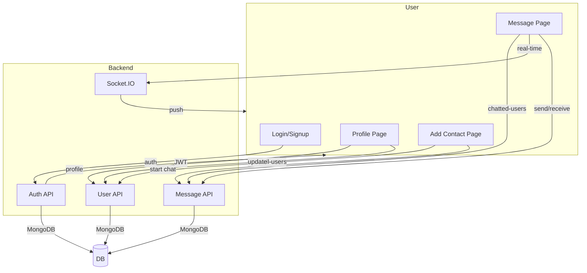

# Connect Fullstack Chat App

A modern, fullstack real-time chat application with user profiles, contact discovery, and advanced chat features. Built with React, Vite, Tailwind, Zustand, Express, MongoDB, and Socket.IO.

---

## 🚀 Features
- **Authentication**: Signup, login, JWT-based sessions
- **Profile Management**: Edit profile, upload avatar, update bio
- **Add Contacts**: Discover and search all users, view profiles, start new chats
- **Chat**: Real-time 1:1 messaging, image sharing, emoji picker, message deletion
- **Sidebar**: Only shows users you've chatted with
- **Responsive UI**: Beautiful, modern, and mobile-friendly
- **Skeleton Loaders**: Gray animated skeletons for smooth loading
- **Online Status**: See who's online in real time
- **Profile Preview**: Click any user to preview their profile
- **Recent Chats First**: Most recent conversations always at the top
- **Search**: Find users by name in Add Contact
- **Dark/Light Mode**: Toggle for user preference (if enabled)

---

## 🖼️ Screenshots

### Login & Signup


### Add Contact Page


### Chat Page


### Profile Page


---

## 🛠️ Technologies Used
- **Frontend**: React, Vite, Tailwind CSS, Zustand, Socket.IO-client, Lucide React, Emoji Picker
- **Backend**: Express, MongoDB, Mongoose, Socket.IO, Cloudinary (for images), JWT, bcrypt
- **Dev Tools**: Nodemon, ESLint, DaisyUI

---

## 🏗️ Architecture



---

## 📝 How to Run the Project

### 1. **Clone the repository**
```bash
git clone <your-repo-url>
cd finalyearproject
```

### 2. **Install dependencies**
```bash
npm install --prefix backend
npm install --prefix frontend
```

### 3. **Setup environment variables**
- Copy `.env.example` to `.env` in the backend and fill in your MongoDB, JWT, and Cloudinary credentials.

### 4. **Start the backend**
```bash
cd backend
npm run dev
```

### 5. **Start the frontend**
```bash
cd ../frontend
npm run dev
```

### 6. **Open the app**
- Visit [http://localhost:5173](http://localhost:5173) in your browser.

---

## ✨ Functionality Overview
- **Add Contact**: Browse/search all users, view profiles, start new chats
- **Message**: Only see users you've chatted with, real-time updates, most recent at top
- **Profile**: Edit your info, upload avatar, update bio
- **Responsive**: Works on desktop and mobile
- **Modern UI**: Clean, animated, and user-friendly

---

## 🙏 Credits
- Built by Akash Jaiswal, Suman Maharana, Abhimanyu
- UI icons by [Lucide](https://lucide.dev/)
- Emoji Picker by [emoji-picker-react](https://github.com/ealush/emoji-picker-react)
- Special thanks to open source contributors!

---

## 📢 Feedback & Contributions
Pull requests and suggestions are welcome! If you find a bug or want a new feature, open an issue or PR. 